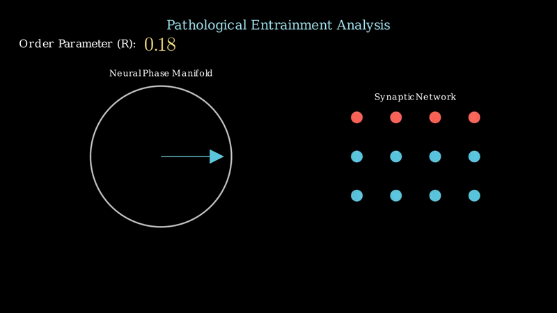

# Technical Appendix: Computational Framework for Seizure Modeling

This documentation serves as a supplementary technical resource for the research presented at the **47th International Medical Scientific Congress**. It provides the underlying biophysical parameters, induction methods, and signal processing workflows discussed in our poster.

## 1. Cellular Foundation: The Izhikevich Model
To ensure clinical accuracy, we utilized the Izhikevich model to represent cortical neurons. This model captures essential non-linear dynamics, allowing us to simulate realistic action potential morphologies that align with biological constraints of human cortical tissue.

* **The Physics of the Neuron:** This animation demonstrates how the differential equations govern the membrane potential ($v$) and the recovery variable ($u$), providing a biophysically plausible unit for our network.

## 2. Seizure Induction: Focal Stimulus & Ictal Triggering
To simulate the onset of a focal seizure, we applied a **localized high-frequency stimulus** to a specific cluster of neurons within the network. This "focal focus" mimics an epileptogenic zone, a well-established method in computational epileptology.

* **Trigger Mechanism:** By injecting a targeted current ($I_{focal}$), we observe how local hyper-excitability overcomes the surrounding inhibitory tone, leading to the recruitment of neighboring healthy neurons into the ictal state.

## 3. Intercellular Communication: Ohmic Gap Junctional Flow
The rapid spread from the focal focus to the rest of the network is facilitated by electrical synapses (Gap Junctions). We modeled these as Ohmic conductances, which are identified as critical factors in shaping and sustaining epileptiform activity.

* **The Mechanism of Spread:** This visualization illustrates how the potential difference ($\Delta V$) between neurons drives the synchronization current ($I_{gap} = G \cdot \Delta V$), serving as the primary pathway for rapid seizure propagation.

## 4. Signal Processing: Band-Pass Filtering
To analyze the resulting signals in a clinically relevant manner, the raw simulated local field potentials (LFP) underwent **digital filtering** to isolate relevant oscillations from computational background noise.

* **Methodology:** We applied a band-pass filter to isolate frequency bands associated with ictal discharges, ensuring our data processing remains consistent with clinical EEG standards used in diagnostic neurology.

## 5. Pathological Transition: Kuramoto Order & Phase-Locking
We quantify the success of the seizure induction and the degree of stabilization through the Kuramoto Order Parameter ($R$).

* **The Proof of Synchronization:** This animation confirms that as the Kuramoto order increases, individual neurons lose their independent firing patterns and become "locked" in phase. This represents the hypersynchronous activity seen in clinical epilepsy, which can be modulated by anti-epileptic agents targeting gap junctional networks.

---

## References

[1] Volman, V., Perc, M., & Bazhenov, M. (2011). Gap junctions and epileptic seizures–two sides of the same coin? *PLOS ONE*, 6(5), e20572.

[2] Naze, S., Bernard, C., & Jirsa, V. (2015). Computational modeling of seizure dynamics using coupled neuronal networks: factors shaping epileptiform activity. *PLoS Computational Biology*, 11(5), e1004209.

[3] Simon, A., Traub, R. D., et al. (2014). Gap junction networks can generate both ripple-like and fast ripple-like oscillations. *The European Journal of Neuroscience*, 39(1), 46–60.

[4] Du, M., Li, J., et al. (2018). Astrocytic Kir4.1 channels and gap junctions account for spontaneous epileptic seizure. *PLoS Computational Biology*, 14(3), e1005877.

[5] Volnova, A., Tsytsarev, V., et al. (2022). The Anti-Epileptic Effects of Carbenoxolone In Vitro and In Vivo. *International Journal of Molecular Sciences*, 23(2), 663.

[6] Strack, B., Jacobs, K. M., & Cios, K. J. (2013). Biological Restraint on the Izhikevich Neuron Model Essential for Seizure Modeling. *International IEEE/EMBS Conference on Neural Engineering*, 395–398.

[7] Mazzoni, A., Lindén, H., et al. (2015). Computing the Local Field Potential (LFP) from Integrate-and-Fire Network Models. *PLoS Computational Biology*, 11(12), e1004584.

---
*Technical documentation prepared for the 47th International Medical Scientific Congress.*

